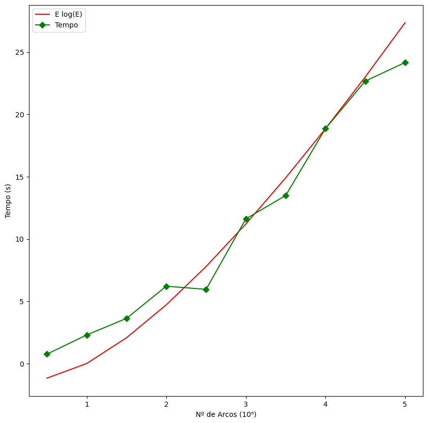

# Relatório 2º Projeto ASA 2021/2022
### Afonso Matos, ist1103479
### Rafael Girão, ist199303
### Grupo 072

## Descrição do Problema e da Solução
Como segundo projeto de ASA foi proposto que, dado um grafo não dirigido $G = (V, E)$, onde:
- Cada vértice representa uma região;
- Cada arco entre dois vértices representa uma ligação ferroviária direta entre estas - o peso de cada arco representa o valor comercial que a construção desta ligação ferroviária traria;

se efetue um algoritmo que tenha como receba como input os arcos deste grafo e devolva o valor máximo de trocas comerciais, minimizando o número de troços ferroviários construídos - obviamente, de modo a que se possa ir de uma região arbitrária para outra.

Em primeiro lugar, é necessário observar que minimizar o número de troços que ligam as regiões (continuando a ser possível viajar de qualquer região para qualquer outra), corresponde a criar uma _Spanning Tree_ do grafo, visto que satifaz a restrição de ligar todas as regiões (grafo ligado) usando o menor número de troços possível.

 Como temos também como objetivo obter o valor máximo de trocas comerciais, concluimos que uma possível solução para o problema dado passa por criar uma _Maximum Spanning Tree_ ($MST$) do grafo, dado que satisfaz adicionalmente o requisito de maximizar o valor dos pesos dos arcos. A solução propriamente dita será devolver o somatório do peso de todos os arcos da árvore criada.

## Análise Teórica
De uma maneira _high-level_, o algoritmo criado começa por ler os arcos do grafo do _stdin_ ($O(E)$); ordena-os por ordem decrescente do valor dos seus pesos, recorrendo ao _introsort_ do C++ (que, da sua documentação, tem complexidade $Θ(N logN)$); aplica o algoritmo de Kruskal (detalhado abaixo); finalmente, devolve o somatório dos pesos dos arcos na $MST$ criada (o pior caso será quando $G$ é esparso e somatório terá que percorrer todos os arcos iniciais, ou seja, $O(E)$).

O algoritmo de Kruskal implementado pode ser descrito pelo seguinte pseudocódigo:
- Inicializar um conjunto $MST$ vazio, e um conjunto $P$, inicialmente com $V$ árvores disjuntas ($O(V)$).
- Para cada arco existente: ($O(E)$)
  - Encontrar a raíz das árvores dos dois nós do arco ($O(1)$, devido à condição abaixo, a recursão implementada não deverá ter que percorrer mais do que um _parent_)
  - Se as raízes forem diferentes, adicionar o arco à MST, e definir o 2º nó do arco como pai do 1º. $(O(1))$
  
Então, como $O(V) < O(V+E) < O(E logE)$, conclui-se que o programa na sua totalidade terá complexidade $(O(E logE))$, vindo esta complexidade final do algoritmo de ordenação usado.
É de notar que a implementação realiza a escolha greedy de selecionar o arco com maior peso, dentro dos possíveis, dado que os arcos são pré-ordenados como descrito acima.

 ### Complexidade Espacial
 O algoritmo implementado começa por guardar um vetor com todos os arcos ($O(E)$), regista uma vetor $MST$ onde, no pior caso (um grafo inicial esparso), o algoritmo de Kruskal guardará todos os arcos iniciais ($O(E)$). Por sua vez, internamente, o algoritmo de Kruskal regista um outro vetor onde regista o _parent_ para cada um dos vértices ($O(V)$). Conclui-se então que o programa terá complexidade espacial $O(V+E)$.

## Avaliação Experimental dos Resultados
O algoritmo foi analizado com a ferramenta de benchmarking `hyperfine` (descartando _outliers_). Os grafos foram gerados com o programa `dgg` (modificado para que todos os arcos tenham peso = 1, para forçar o pior caso de _Kruskal_), sendo $V+E \in [0.5M, 5M]$, não tendo ocorrido _outliers_.

Observando o gráfico, dada a proximidade da complexidade teórica ($ElogE$) com a observada, fica assim comprovada a complexidade teórica declarada.